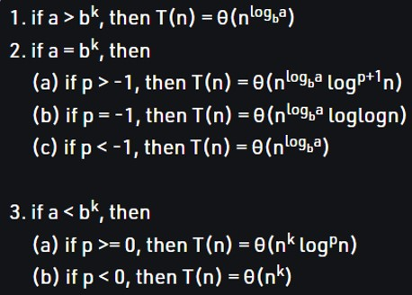

# Complexity analysis
- [Time complexity](lectures/1.Time_complexity.pdf)
  - Worst case, Best case and Average case time complexity
  - Examples for `O(n)` and `O(n^2)`
  - Types


- [Space complexity](lectures/3.Space_complexity.pdf)
  - Examples for `O(1)` and `O(n)`
  - Recurrence example fro space complexity
```
int addUpto(int n){
  if (n <= 0){
      return 0;
  }
  return n + addUpto(n-1);
}
// Output 
1.  addUpto(4)
2.    -> addUpto(3)
3.      -> addUpto(2)
4.        -> addUpto(1)
5.          -> addUpto(0)
Each of these calls is added to the call stack and takes up actual memory.
So it takes O(n) space
```
- Time complexity of recurrence relations
  - Substitution method
```
// 1
T(n) = 2T(n/2) + 4n
// 2- Determine the recurrence relation for the following series 
1,7,31,127,499
```
  - Recurrence tree method
```
// 1
T(n) = 2T(n/2) + n^2
// 2
T(n) = T(n/3) + T(n/4) + kn
```
  - Master’s theorem


```
// 1
T(n) = 3T(n/5) + 5n^2
// 2
T(n) = 2T(2n/3) + 1
```
