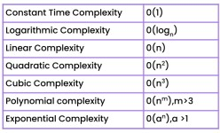

# Complexity analysis
- [Time complexity](lectures/1.Time_complexity.pdf)
  - Types


- [Space complexity](lectures/3.Space_complexity.pdf)
  - Recurrence example
```
  int addUpto(int n){
    if (n <= 0){
        return 0;
    }
    return n + addUpto(n-1);
}
// Output 
1.  addUpto(4)
2.    -> addUpto(3)
3.      -> addUpto(2)
4.        -> addUpto(1)
5.          -> addUpto(0)
Each of these calls is added to the call stack and takes up actual memory.
So it takes O(n) space
```
- Time complexity of recurrence relations
