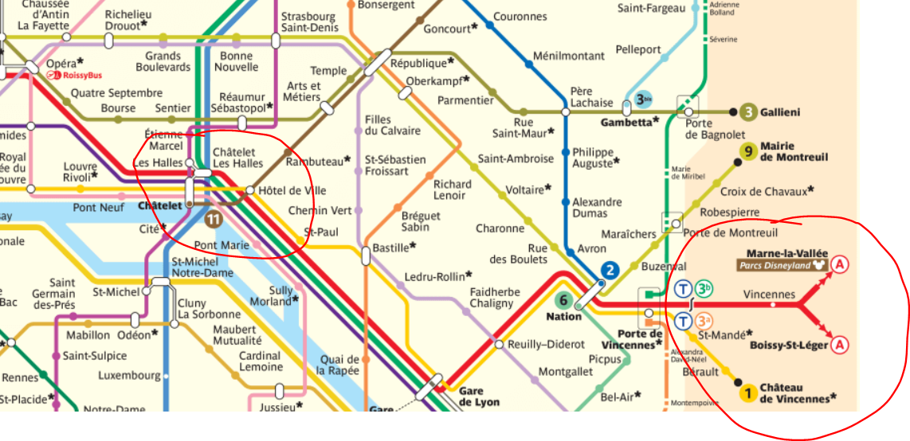
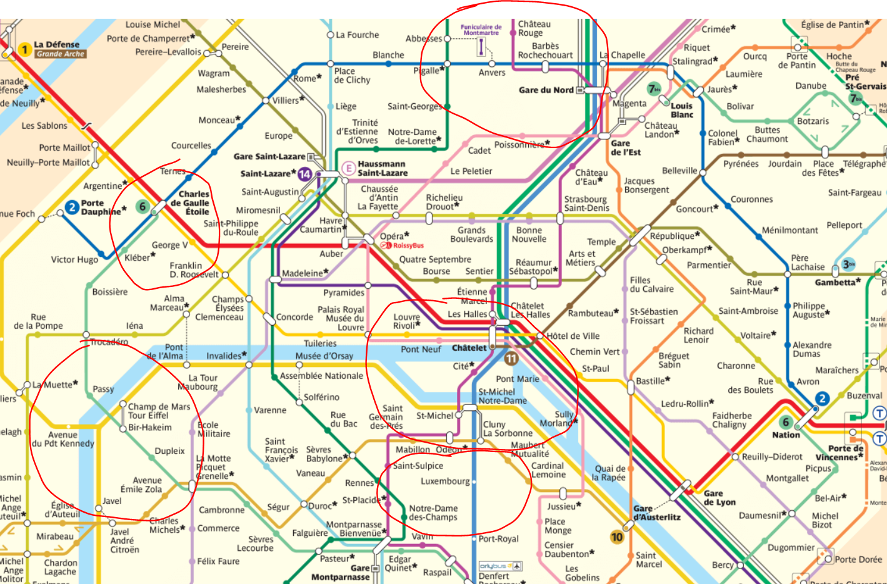
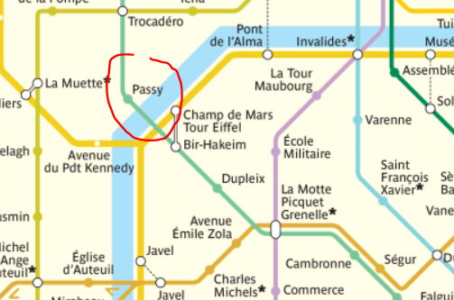
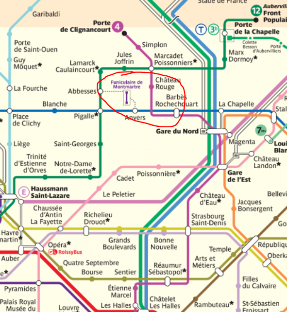
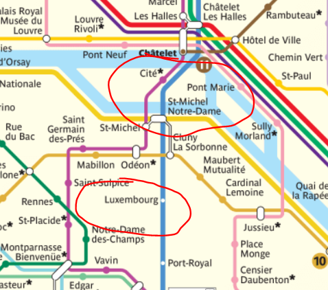

# [Metro map for Paris](https://cdn.tourbytransit.com/paris/images/paris-metro-map.png)

- CDG is on right top corner, as you can see it's the blue line
- Gare du Nord is good location to stop for hotels, bit less expensive than middle center
- Les Halles is near louvre etc it's the main centeral hub but it's a bit more expensive but then easy to walk everywhere
- denfeurt rocheraus is already way away from center
- but keep it easy and book hotel near these stations
- `les halles` would be the best as there from the same station leaves also train to disney world

# Place to visit
- it's a huge city distances are very long
- these are the main parts you need to walk around
- so just check what are good metro lines to get there

# Place to watch Eifel tower from

# Sacre cour basilique
- Sacre cour basilique is the best view of the city but walk over 100 steps up first, either when sun is going up or down

# luxembuoug park

## 
- Salut -> hi
- Merci  -> thank you
- Au Revoir -> bye
- Je voudrais -> I would like to have
- Un - 1, deux - 2, trois 3, quatre 4
- Croissant -> croissant
- Billet - ticket
- s'il vous plaît  please
